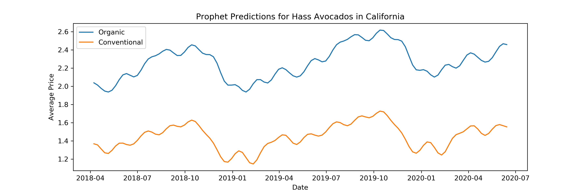
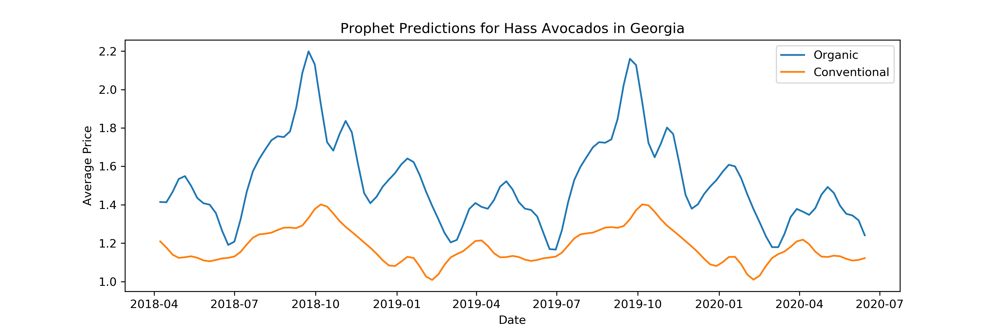
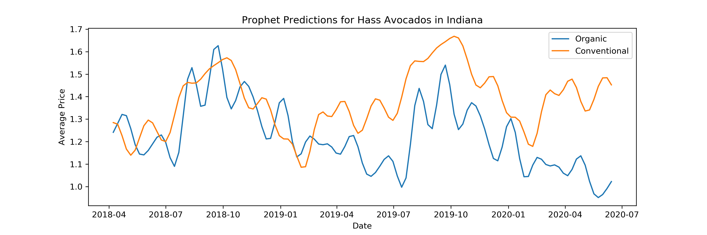

# avocado_prices

**Objective**
The goal of the project was to predict the prices of avocados in the general United States, and take a deeper look into states that we had data for and find the state with the lowest avocado prices. To do so, we needed to create a baseline model and a more fine-tuned model that would predict prices with the lowest root mean squared error possible, to best assert which state would have the lowest prices in the future. 

**Explaining the Data**
For our project, we were able to find a dataset from [Kaggle](https://www.kaggle.com/neuromusic/avocado-prices), which consisted of about 18,000 rows and 10 columns. For our purposes we only needed the date, region, type and total volume columns. The date column consisted of weekly data points starting in 01/04/2015 - 03/25/2018. The region column included about 45 unique cities and 8 regions that generalized an area of the United States (such as Midsouth or Northern New England), which we decided to group to a state level. We removed the rows that referenced those 8 regions and grouped the cities by state, leaving us with 27 unique states. Now our dataset had about 15,000 rows and 4 columns.

**Methodology**
We first tested our data for stationarity (it was stationary). Then we created ACF and PACF plots to find the auto regressive and moving average values that would work for us. We then set up loops for various AR and MA values to find the best possible order. Using this order, we set up ARIMA models for both conventional and organic avocados as our baseline. We continued to work on our modeling by setting up SARIMAX models to account for seasonality. However, our prediction plots did not seem very intuitive, so we decided to trying Facebook's Prophet model, which ended up returning the best results (the lowest RMSE). We created all these models using the mean values for all states per date, which would generalize the United States. Our code for these tasks could be found in the [data_exploration notebook](data_exploration.ipynb).
We then set up Prophet models for California, Georgia and Indiana. We chose these three states since California and Indiana were the states with the highest and lowest volume of purchased avocados, while Georgia was more of a middle ground. We predicted the avocado prices for these three states up to July of 2020. Our code for the regional predictions could be found in the [regional notebook](regional.ipynb).

**Findings**
From our data, we were able to infer that with a low purchase volume, there becomes a smaller disparity between the price of conventional and organic avocados, which led us to believe that in such situations it is difficult for us to say that the two are completely independent of each other. To be more confident in our predictions, we believe we would need to have more dates or areas with a higher volume of purchases. Additionally, when the demand for avocados is high, the price would be high as well, but as demand decreases so does the correlation between price and demand.

**Given More Time**
We would have liked to set up a Prophet model for each of the states so that we could more concretely say which state would have the cheapest avocados. We would have liked to run a Recurrent Neural Net (such as an LSTM model), to better train our model for inconsistencies (i.e. we noticed a spike in prices for both types in 2017) and compare it to our Prophet models.

[CSV files we used and/or created](csv_files)

[Images used in our presentation](Images)

[Link to Google Slides presentation](https://docs.google.com/presentation/d/1agMnZlSJ_Yi2I5V7aAK3pCDMi5aqE0XjpWvwhwsB0iI/edit?ts=5eea2515#slide=id.g54dda1946d_6_358)
